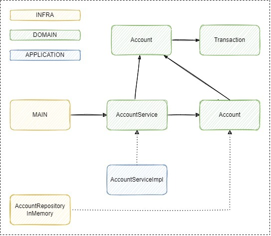

# BANK KATA SKELETON (for Kotlin Padawans)

Just a Bank Kata Skeleton for the well known Bank Kata exercise.

You can follow the instructions in any of the exercises published in internet

[Bank kata - Codurance Katalyst](https://katalyst.codurance.com/bank)

[Bank Kata - kata-log.rocks](https://kata-log.rocks/banking-kata)

## Rules

The only rule is to not modify the two interfaces present in the code `AccountService` and `TransactionRepository`. All
the other files can be modified, replaced or even removed.

## Simple diagram of the skeleton (_for exercise 1_)

## Exercises

### Starting Basic
[Exercise 1](https://github.com/caay2000/bank-kata-skeleton/tree/exercise-1)
[[Solution](https://github.com/caay2000/bank-kata-skeleton/tree/exercise-1-solution)]

Implement the diagram in the easiest way possible, just complete the interfaces and the code. Do not complicate yourself with the balance or with any other thin. Keep it simple!

### Moving from Transaction to Account
[Exercise 2](https://github.com/caay2000/bank-kata-skeleton/tree/exercise-2)
[[Solution](https://github.com/caay2000/bank-kata-skeleton/tree/exercise-2-solution)]

We realised that our Transactions are not enough to store some information like the account current balance. Just use the new Account object and change whatever you need in order to make it work. And remember, keep it simple!

### Disclaimer

This is just for learning purposes, there are some incorrect approaches that are explicitly there for the aim of
learning some specific concepts before moving to a more advanced topics